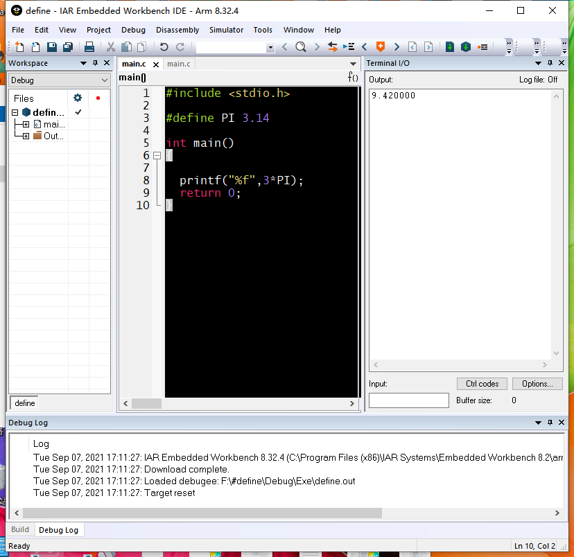
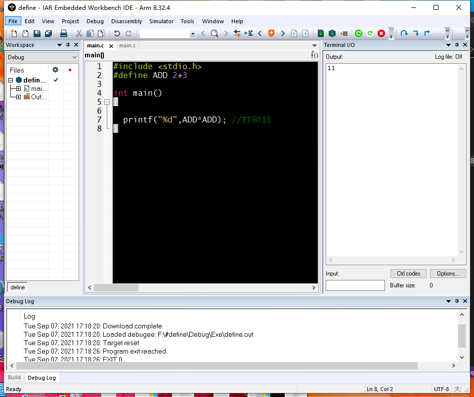
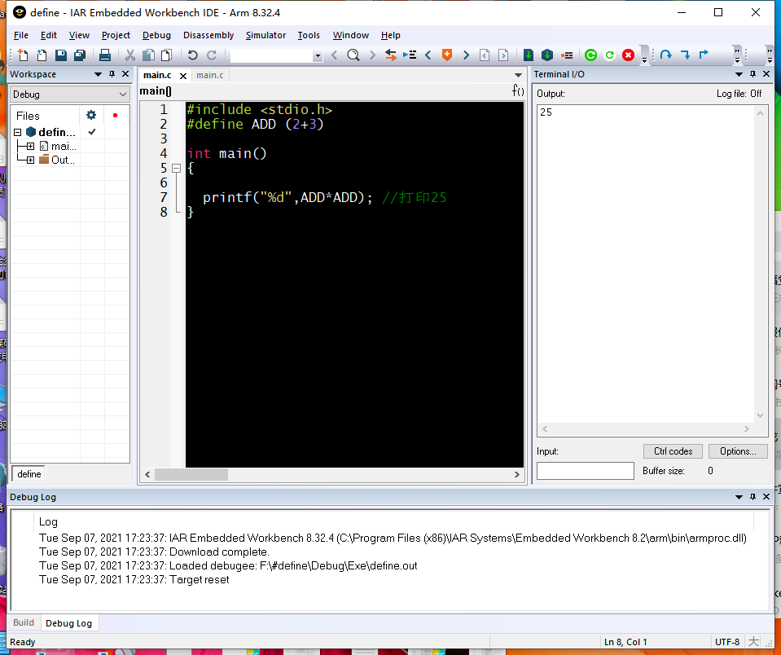
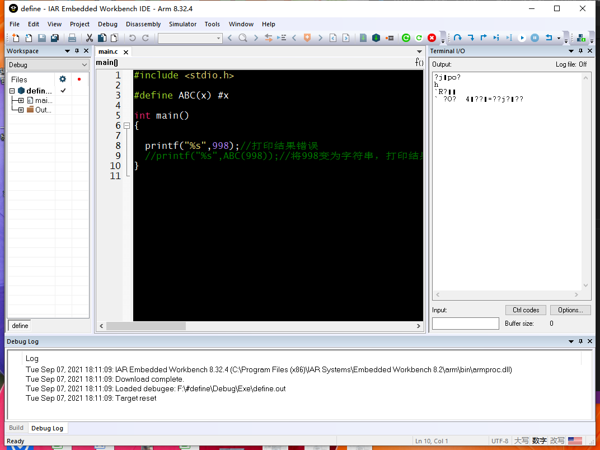
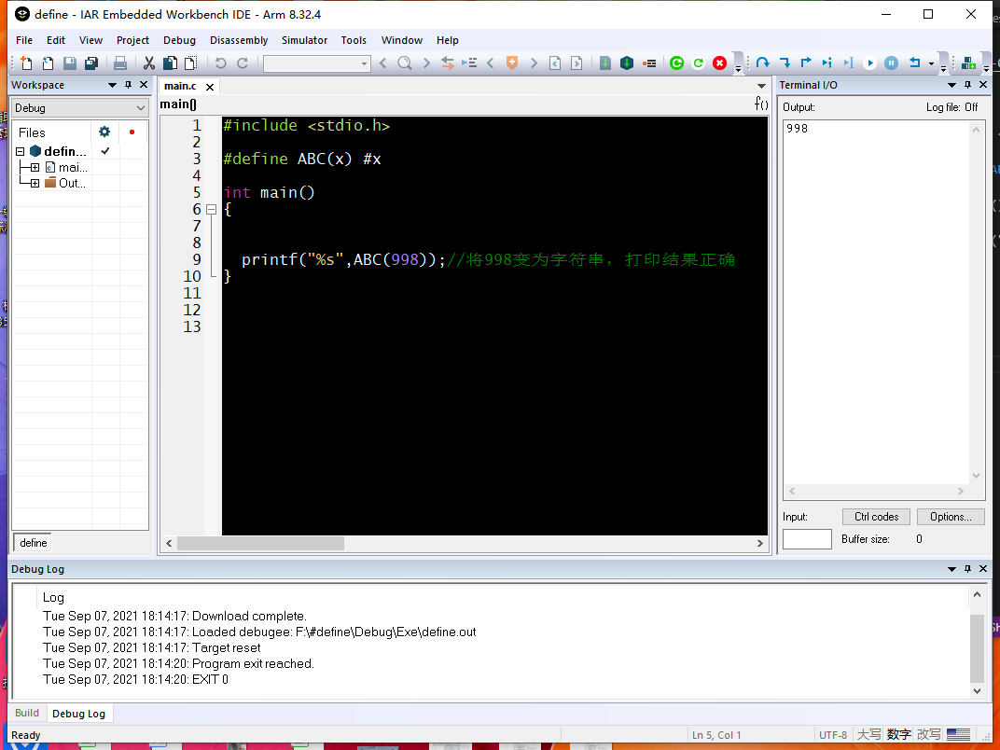
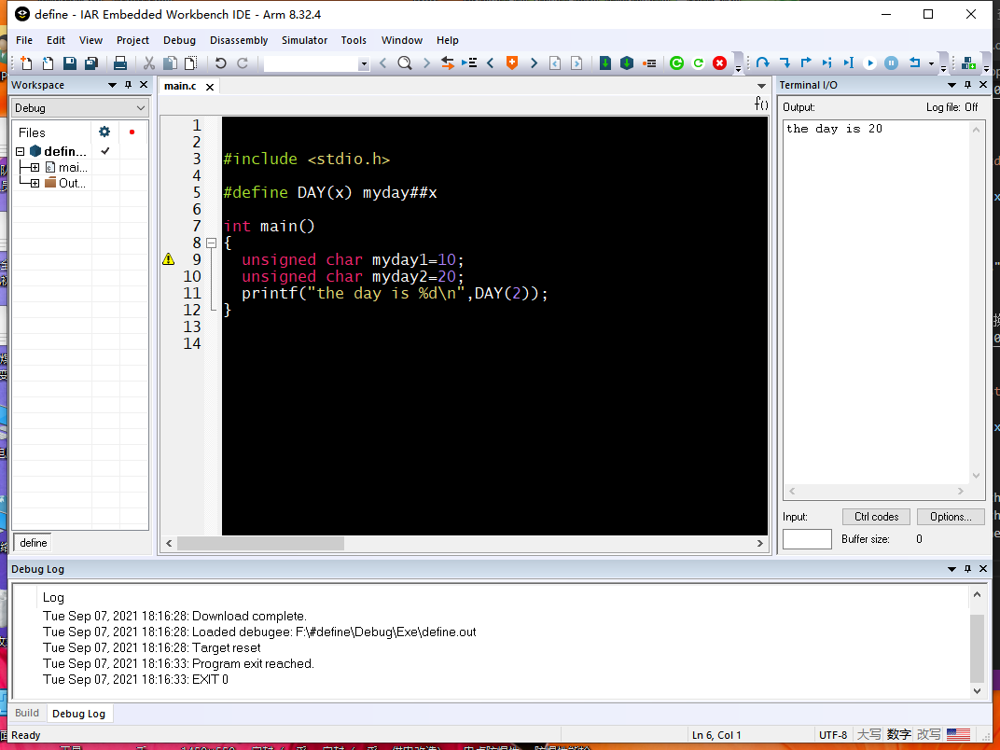
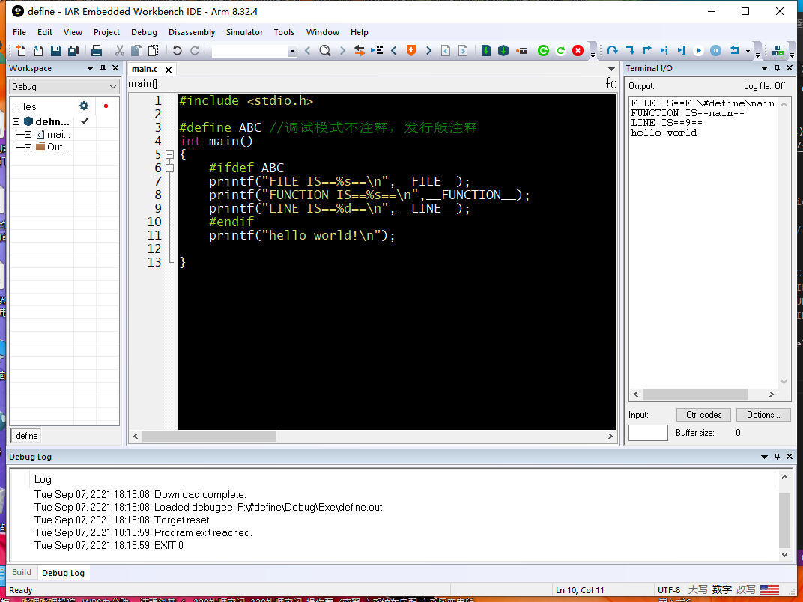
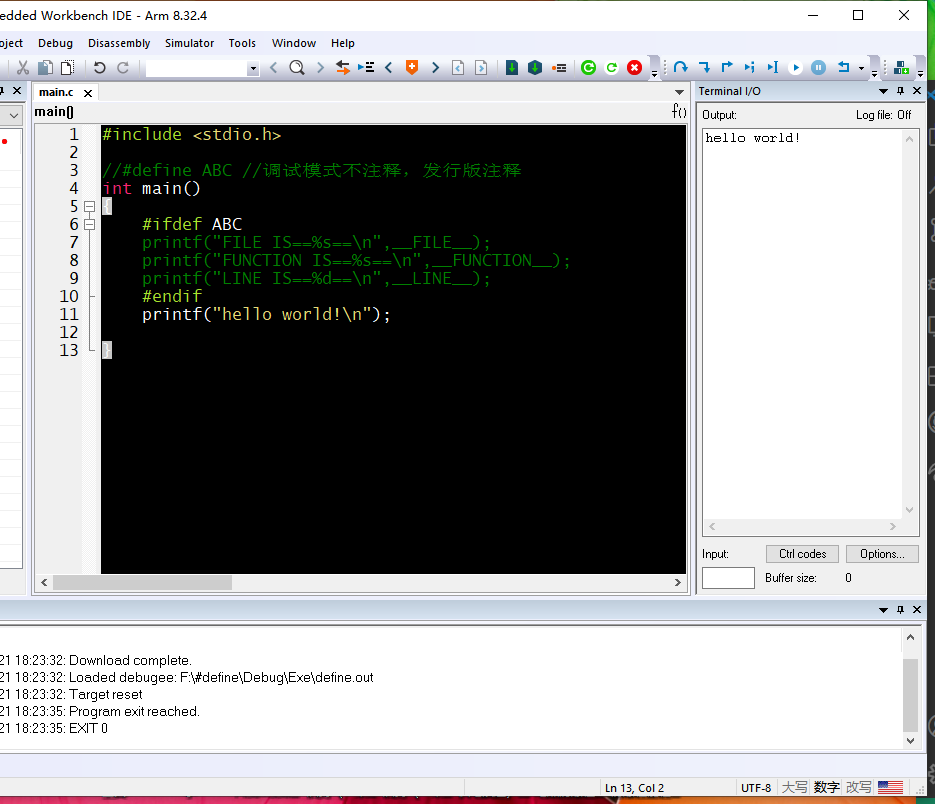

```c
#include <stdio.h>

#define PI 3.14

int main()
{

  printf("%f",3*PI);
  return 0;
}

```
#define的作用就是将PI替换为3.14



```c
#include <stdio.h>
#define ADD 2+3

int main()
{
 
  printf("%d",ADD*ADD); //打印11
}
```
我们预期的结果是25，但是打印结果是11，因为#define知识简单的替换，所以要按照运算法则运算即2+3*2+3先算乘除后算加减，所以运算结果是11

结论：我们必须加()



```c
#include <stdio.h>

#define ABC(x) #x

int main()
{
 
    printf("%s",998);//打印结果错误
 
}

````
强行将整数打印成字符串出现乱码



```c
#include <stdio.h>

#define ABC(x) #x

int main()
{
  printf("%s",ABC(998));//将998变为字符串，打印结果正确
}
```
使用#，可以转换成字符串打印结果正确


 ```c
 #include <stdio.h>

#define DAY(x) myday##x

int main()
{
  unsigned char myday1=10;
  unsigned char myday2=20;
  printf("the day is %d\n",DAY(2));
}
```
##连接符 DAY(1)输出myday1,DAY(2)输出mayday2



```c
#include <stdio.h>

#define ABC //调试模式不注释，发行版注释
int main()
{
    #ifdef ABC
    printf("FILE IS==%s==\n",__FILE__);
    printf("FUNCTION IS==%s==\n",__FUNCTION__);
    printf("LINE IS==%d==\n",__LINE__);
    #endif
    printf("hello world!\n");

}
```
__FILE__  为文件所在位置

__FUNCTION__ 为所在函数

__LINE__   为所在行

如果有#define ABC，则 #ifdef ABC ```#endif之间的语句将会被编译



```c
#include <stdio.h>

//#define ABC //调试模式不注释，发行版注释
int main()
{
    #ifdef ABC
    printf("FILE IS==%s==\n",__FILE__);
    printf("FUNCTION IS==%s==\n",__FUNCTION__);
    printf("LINE IS==%d==\n",__LINE__);
    #endif
    printf("hello world!\n");

}
```
如果没有#define ABC，则 #ifdef ABC ```#endif之间的语句将不会被编译



